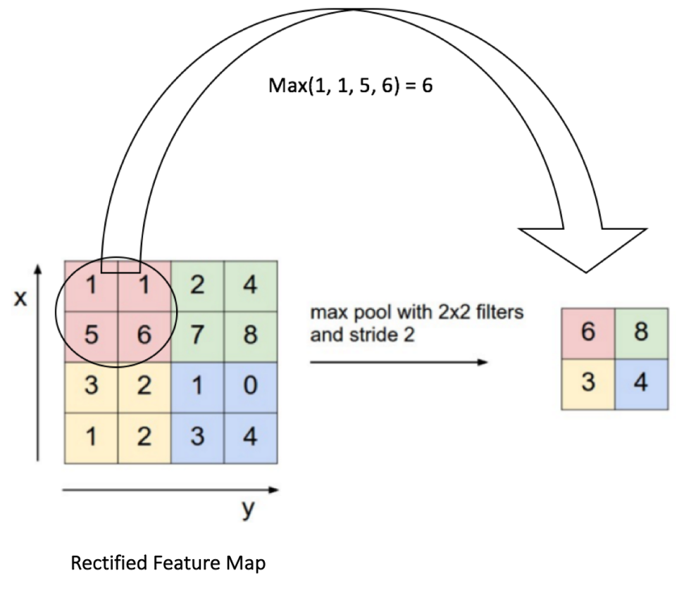

# 1. Theoretical Tasks

## 1.1 Image Convolution calculation

### Theoretical Background

Read the following two blog posts:

 * [What are convolutions?](https://vaulttech.github.io/2017/08/12/what-are-convolutions/)
 * [Convolutions and Neural Networks](https://vaulttech.github.io/2017/08/28/convolutions-and-neural-networks/)

### Task

Now consider the following image $I$, represented as a matrix:

$$
I = 
\begin{bmatrix}
0  & 0  & 0  & 0  & 0  & 0 \\
0  & 1  & 1  & 1  & 1  & 0 \\
0  & 1  & 2  & 2  & 1  & 0 \\
0  & 1  & 2  & 2  & 1  & 0 \\
0  & 1  & 1  & 1  & 1  & 0 \\
0  & 0  & 0  & 0  & 0  & 0 \\
\end{bmatrix}
$$

And the following kernel $k$, represented as a matrix:

$$
k =
\begin{bmatrix}
1  & 1  & 1  \\
2  & 2  & 1  \\
1  & 2  & 1  \\
\end{bmatrix}
$$

Calculate a _same_ convolution $I \ast k$ as described in `Convolutions and
Neural Networks` above.

## 1.2 Max Pooling calculation

### Theoretical Background

Max Pooling divides the input image in several sections of a given size. This
size is often referred to as _subsample size_, or _filter size_. Then,
for each section, we only return the biggest value present in that section.
For example, in the image below, the sections are of size $(2,2)$:

It is easy to notice that the output image will have a smaller size than the
input. In this case, because the filter size is $(2,2)$, the final size of the
image half of the original image. If it were $(3,3)$, then the final size
would be one third of the original image.

### Task

Given the image $I$ below, apply Max Pooling with a filter size of $(3,3)$:

## 1.3 A Neural Network example

The Convolution and the Max Pooling operation above can be combined to build
a CNN. In general, the Convolutional layer is followed by a nonlinearity, and
finally by Max Pooling layer. The process can be repeated several times.
At the end, it is common to have a fully connected layer followed by a
softmax. In the exercise below you have to calculate by hand each one of the
steps.

 1) First, calculate a convolution between the image $I$ and the kernel $k$:
    (these are the same calculated above)

$$
I = 
\begin{bmatrix}
0  & 0  & 0  & 0  & 0  & 0 \\
0  & 1  & 1  & 1  & 1  & 0 \\
0  & 1  & 2  & 2  & 1  & 0 \\
0  & 1  & 2  & 2  & 1  & 0 \\
0  & 1  & 1  & 1  & 1  & 0 \\
0  & 0  & 0  & 0  & 0  & 0 \\
\end{bmatrix}
$$

$$
k =
\begin{bmatrix}
1  & 1  & 1  \\
2  & 2  & 1  \\
1  & 2  & 1  \\
\end{bmatrix}
$$

_Solution_:

$$
k =
\begin{bmatrix}
7   & 10  & 10  & 6   \\
12  & 18  & 17  & 10  \\
12  & 19  & 18  & 10  \\
8   & 12  & 12  & 7   \\
\end{bmatrix}
$$

 2) Then calculate the output of the Rectified Linear Unit;

_Solution_:

In this case, the matrix doesn't change, because all values are positive

 3) Then apply Max Pooling to the resulting matrix;

_Solution_:

$$
I = 
\begin{bmatrix}
18  & 17  \\
19  & 18  \\
\end{bmatrix}
$$

 4) Now flatten the resulting image by putting all the rows of the image in
    one same line. For example, the image below:

$$
I = 
\begin{bmatrix}
0  & 1  \\
2  & 3  \\
\end{bmatrix}
$$

&nbsp; will become:

$$
I_{flattened} = [0, 1, 2, 3]^T
$$

_Solution_:

$$
I_{flattened} = [18, 17, 19, 18]^T
$$

 5) Calculate the output of a Fully Connected layer. Use the following $W$:

$$
W =
\begin{bmatrix}
1  & 2  & 3  & 4  \\
5  & 6  & 7  & 8  \\
\end{bmatrix}
$$

_Solution_:

$$
k =
\begin{bmatrix}
1 \times 18  + 2 \times 17  + 3 \times 19  + 4 \times 18 = 181  \\
5 \times 18  + 6 \times 17  + 7 \times 19  + 8 \times 18 = 469  \\
\end{bmatrix}
$$

 6) Finally, you will have 2 outputs. It is common to apply a softmax operation
    over these outputs. In our case, since we have only two classes, just take
    the bigger one.

